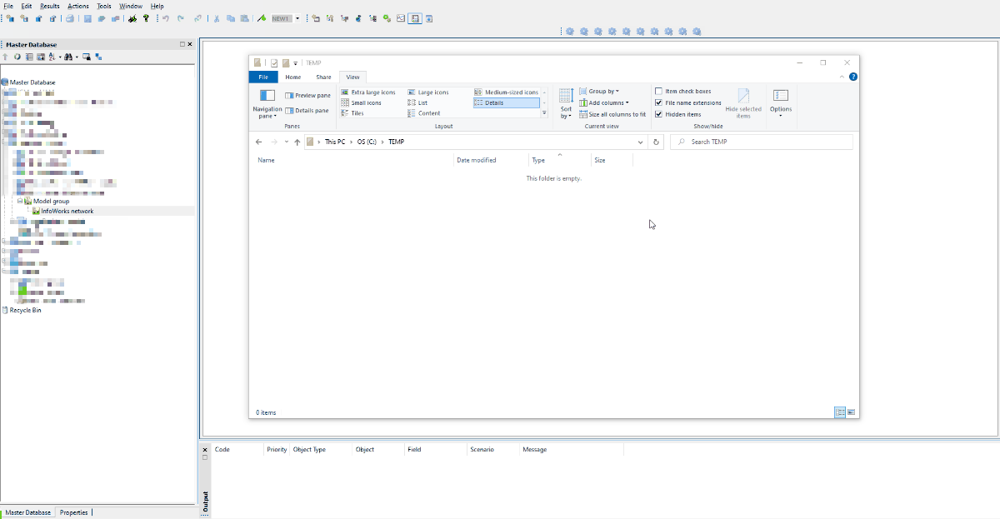

# InfoWorks ICM Ruby scripts

This directory contains examples of tasks that can be performed using Ruby cripts. These are stored in sub-directories prefixed with a counter and a brief README.md description. They can be either ICM UI scripts or ICMExchange scripts.

## UI scripts
Scripts with the name `UI_script.rb` are run from within the ICM graphics interface. A quick way to get started is:
1. Create a `test.rb` file in a known location, preferably close to the drive root and without special characters in the path.
2. Create an Action which points at the `test.rb` script.
3. Copy paste the code you are testing from GitHub into this file using a text editor.
4. Run it in ICM in a relevant network.

## Exchange scripts
Scripts with the name `EX_script.rb` are run passing the script to the ICMExchange API. 
The directories in this repository might contain example databases to test the scripts on. There are ways to download a specific directory, but it is probably easier to clone the whole repository (it's not that big anyway). 
This example shows cloning by downloading the zip file. More avanced users might want to clone using other methods.
1. Ensure the machine can access a valid Exchange license.
2. Clone the repository from GitHub
3. Extract the zip file onto a known location. You should consider doing so on a folder close to the drive root, since the full paths of the cloned repository are long, and Windows might not be able to extract all of them.
4. You should now have a clone of the GitHub repository. Navigate to the example that you need.
5. Run the `exchange.bat` file. 
6. Check the results of the script.

Note that downloaded `bat` files are often recognised as a threat by malware detection algorythms. This is a blanket warning because scripts can be used for malicious purposes. There is nothing malicious about the `bat` files under this repo, they are simply used to push the Ruby script to the Exchange API, and are completely open to interrogation from GitHub before being downloaded. 

However, if for any reason you can't use the `bat` files from our repository, you can create an equivalent `bat` file in your local machine (or equivalent shell script). In fact, you can copy past the exact same code lines from GitHub onto the locally created file and this will likely allow you to run the file without warnings.
