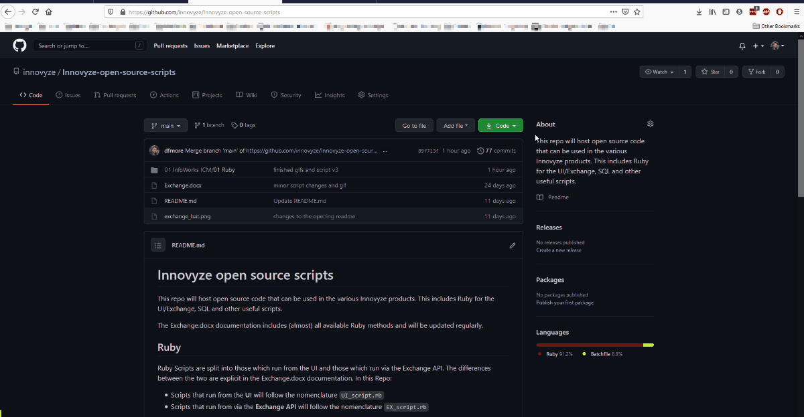

# Ruby in InfoWorks ICM

This directory contains examples of tasks that can be performed using Ruby scripts. These are stored in sub-directories prefixed with a counter and a brief README.md description. They can be either ICM UI scripts or ICMExchange scripts.

## UI scripts
Scripts with the name `UI_script.rb` are run from within the ICM graphics interface. A quick way to get started is:
1. Create a `test.rb` file in a known location, preferably close to the drive root and without special characters in the path.
2. Create an Action which points at the `test.rb` script.
3. Copy paste the code you are testing from GitHub into this file using a text editor.
4. Run it in ICM in a relevant network.

## Exchange scripts
These scripts will sometimes be packaged alongside an example database and an `exchange.bat` file. The contents of the database should contain the necessary model objects to test the script. The aim is to allow users to hit the ground running these scripts as seamlessly as possible. Sometimes this will be a zipped standalone database that should be extracted to the same directory as the script.
There are ways to download a specific directory, but it is probably easier to clone the whole repository (it's not that big anyway). This example shows cloning by downloading the zip file. More avanced users might want to clone using other methods.
1. Ensure the machine can access a valid Exchange license.
2. Clone the repository from GitHub
3. Extract the zip file onto a known location. You should consider doing so on a folder close to the drive root, since the full paths of the cloned repository are long, and Windows might not be able to extract all of them.
4. You should now have a clone of the GitHub repository. Navigate to the example that you need.
5. Run the `exchange.bat` file. 
6. Check the results of the script.

### Note
Downloaded `bat` files are often recognised as a threat by malware detection algorythms. This is a blanket warning because scripts can be used for malicious purposes. There is nothing malicious about the `bat` files under this repository, they are simply used to push the Ruby script to the Exchange API, and are completely open to interrogation from GitHub before being downloaded. 

However, if for any reason you can't use the `bat` files from our repository, you can create an equivalent `bat` file in your local machine (or equivalent shell script). In fact, you can copy past the exact same code lines from GitHub onto the locally created file and this will likely allow you to run the file without warnings.

# SQL in InfoWorks ICM
InfoWorks ICM implements its own subset of SQL (Structured Query Language) for selecting and updating network objects using specified criteria. 

An SQL query consists of a number of clauses separated by semi-colons. Each clause can do one of the following:
    Select objects 
    Deselect objects 
    Update fields in objects 
    Clear the selection

The SQL query is built on the SQL Dialog. To open the dialog, choose SQL select... from the Selection menu, or click the  button from the Selection toolbar.

There is considerable resource already contained within the ICM Help (press F1) to assist users with SQL and to understand the available functionality. This should be the first place to investigate and understand what is possible. This repository is designed to provide practical examples and to show working syntax based on historic requests we have had from customers. 

## InfoWorks ICM Help - SQL in InfoWorks ICM

## Community input welcome!
If you have any great SQLs that you would like to share with the modelling community then please provide them to support@innovyze.com and we will try and get them uploaded as soon as possible. Additionally if you make any enhancements to our scripts or find any bugs then please let us know. 

Together we grow!
